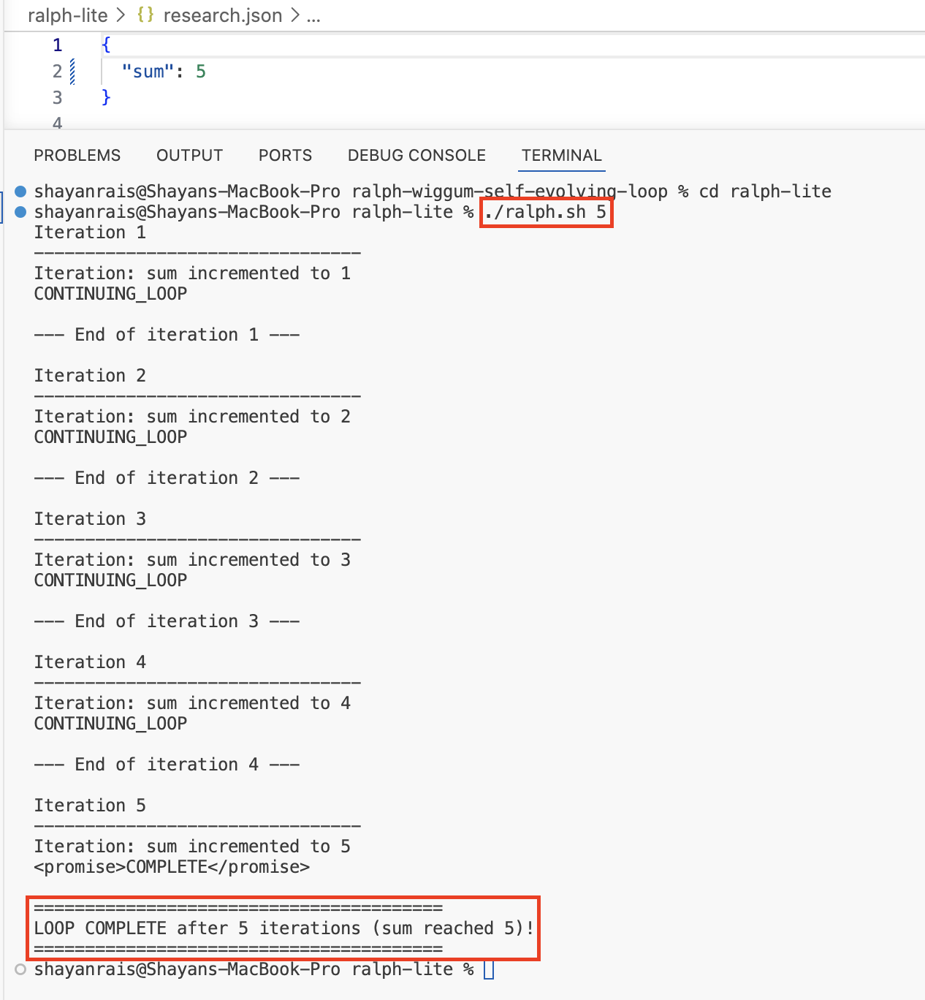

# Ralph Wiggum Lite

A minimal demonstration of the **Ralph Wiggum loop** pattern: a bash loop that repeatedly invokes a Claude Code slash command until a completion signal is emitted.


## What It Does

Each iteration of `ralph.sh`:
1. Invokes the `/execute-ralph-lite` slash command via `claude -p`.
2. The command reads `research.json`, increments `sum` by 1, writes it back.
3. If `sum >= 5`, the command emits `<promise>COMPLETE</promise>` and the loop exits.

## Usage

From inside the `ralph-lite` directory:

```bash
# Reset the counter (optional)
echo '{"sum": 0}' > research.json

# Run the loop — give it enough iterations (>= 5) to reach the exit condition
./ralph.sh 10
```

### Expected Output


